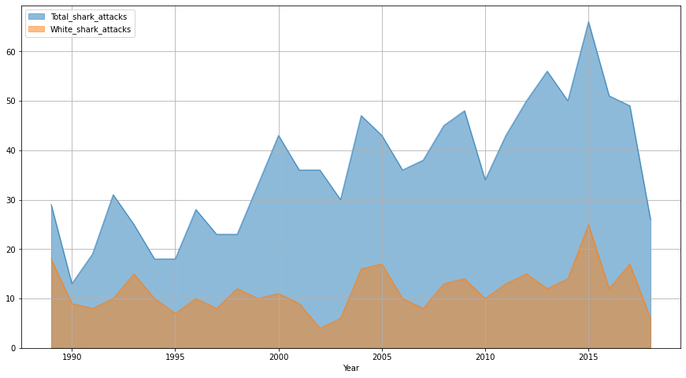

# 
 :shark: :ocean: :shark: Shark Attacks :shark: :ocean: :shark: 

Simple analysis about sharks attacks using [this Kaggle dataset for attacks](https://www.kaggle.com/teajay/global-shark-attacks "kaggle.com") and [this dataset for global temperatures](https://www.kaggle.com/sudalairajkumar/daily-temperature-of-major-cities "kaggle.com")

# Main takeaways

After an initial cleaning and filtering of the data, the following conclusions and observations could be made:

## Correlation with rising temperatures :sunny:

According to the global dataset used (with aggregated mean temperatures by country and year), there was no correlation between the amount of shark attacks and yearly temperature increase:

### Global :earth_americas:

x | Year | Maximum | Median | Average
------------ | ------------- | ------------- | ------------- | -------------
Year |1.000000	|0.087513|	0.084496|	0.088113
Maximum	|0.087513|	1.000000|	0.198585|	0.153631
Median|	0.084496	|0.198585|	1.000000	|0.993841
Average|	0.088113|0.153631|	0.993841|	1.000000
Attacks|	0.020974|	0.578751	|-0.322988|	-0.367387

Not even disaggregating by the top 3 countries with most attacks:

### USA :us:

x | Year | Maximum | Median | Average
------------ | ------------- | ------------- | ------------- | -------------
Year|	1.000000	|0.453210|	0.611918|	0.415605
Maximum|	0.453210|	1.000000|	0.452817|	0.347630
Median|	0.611918|	0.452817|	1.000000|	0.810382
Average|	0.415605|	0.347630|	0.810382|	1.000000
Attacks|	0.376775|	0.402628|	0.497183|	0.277862

### Australia 🇦🇺

x | Year | Maximum | Median | Average
------------ | ------------- | ------------- | ------------- | -------------
Year|	1.000000|	0.305441|	0.807577|	0.804839
Maximum|	0.305441|	1.000000|	0.392914|	0.399139
Median|	0.807577|	0.392914|	1.000000|	0.960049
Average|	0.804839|	0.399139|	0.960049|	1.000000
Attacks|	0.841498|	0.459499|	0.670071|	0.665683

### South Africa 🇿🇦

x | Year | Maximum | Median | Average
------------ | ------------- | ------------- | ------------- | -------------
Year|	1.000000|	0.674573|	0.587306|	0.711466
Maximum|	0.674573|	1.000000|	0.472851|	0.653795
Median|	0.587306|	0.472851|	1.000000|	0.863464
Average|	0.711466|	0.653795|	0.863464|	1.000000
Attacks|	0.043982|	0.232161|	0.109889|	0.117747

## Countries :round_pushpin:

### Top 3 

As expected the top three countries with more shark attack victims are USA, Australia and South Africa:

### Tailing

Long after them, Papua New Guinea, New Zealand, Brazil, Mexico and Italy follow, with other Asian and African countries and islands in the tail:

## Species :shark:

Fueling the popular belief, the Great White Shark is the shark species claiming the most victims and deaths by quite much, 623. Its followers are the Tiger Shark with 258 victims and the Bull Shark with 170.

More than a third of the attacks reported annually involve a White Shark:

## Victims :surfer:

Even though a shark attack may sound fatal, less than a quarter of them involves a human death, all this considering that a fifth of the attacks are provoked by the human in question:

Lethality | Attack Type
------------ | -------------
 | 

Following information regarding the victims, almost 90% are male, the main age range is 18-35 and the two activities at the moment of the attack that amass the most cases are Surfing (including its variants as windsurfing,kite surfing, etc.) and Swimming:

 |
------------ |
*Sex* |

 |
------------ |
*Age* |

------------ |
*Activity at the attack*|
